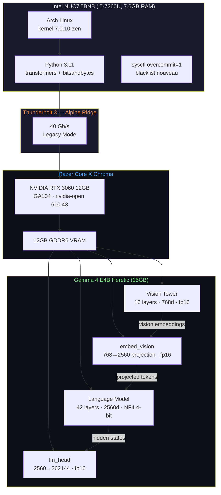
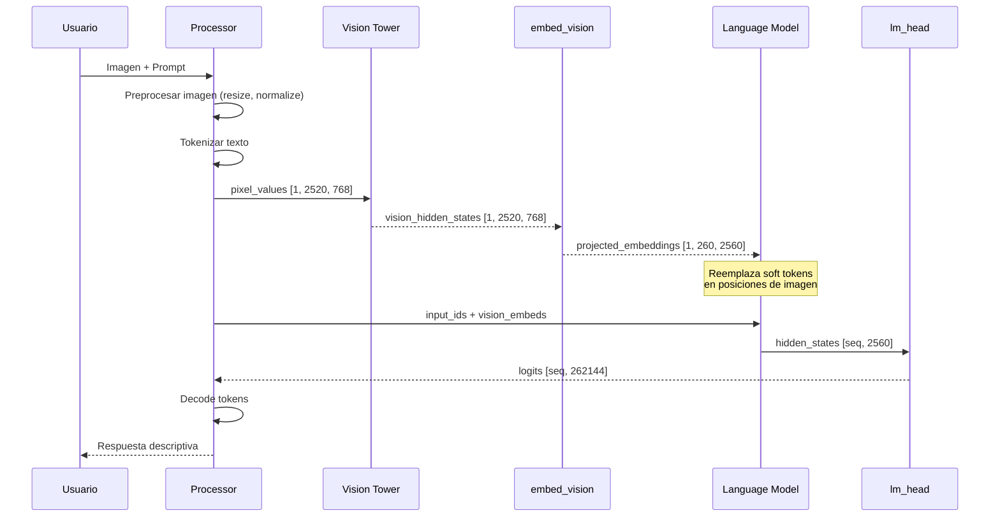
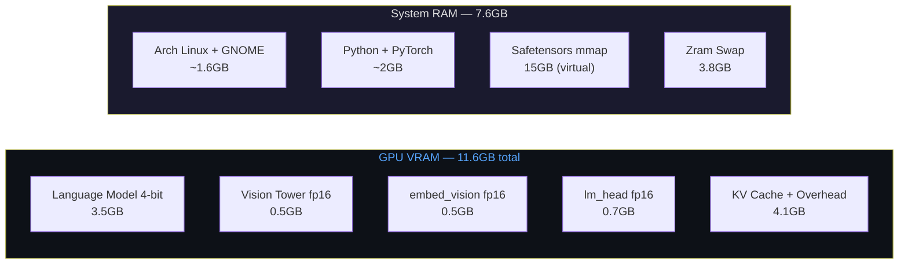

# nuc-gemma4-vision — Technical Requirements Document

## 1. Architecture Diagram



## 2. Component Descriptions

### 2.1 Vision Tower (`model.vision_tower`)
- **Type**: `Gemma4VisionModel`
- **Layers**: 16 transformer layers
- **Hidden dim**: 768
- **Patch size**: 16×16
- **Image seq length**: 280 soft tokens → 2520 patches post-pooling
- **Precision**: bfloat16 (NO cuantizado)
- **VRAM**: ~0.5GB

### 2.2 Language Model (`model.language_model`)
- **Type**: Gemma4 decoder
- **Layers**: 42 transformer layers
- **Hidden dim**: 2560, Intermediate: 10240
- **Vocab**: 262,144 tokens
- **Precision**: NF4 4-bit (bitsandbytes)
- **VRAM**: ~3.5GB

### 2.3 Vision Projector (`model.embed_vision`)
- **Type**: `Gemma4MultimodalEmbedder`
- **Function**: Proyecta embeddings de visión (768d) al espacio del language model (2560d)
- **Precision**: bfloat16 (CRÍTICO: debe excluirse de quantización)
- **VRAM**: ~0.5GB

### 2.4 LM Head (`lm_head`)
- **Type**: `Linear(2560, 262144)`
- **Precision**: bfloat16 (excluido de quantización)
- **VRAM**: ~0.7GB

## 3. Data Flow — Vision Inference



## 4. Memory Layout



## 5. Critical Configuration

### 5.1 BitsAndBytesConfig (inference.py)

```python
bnb_config = BitsAndBytesConfig(
    load_in_4bit=True,
    bnb_4bit_quant_type="nf4",
    bnb_4bit_compute_dtype=torch.bfloat16,
    bnb_4bit_use_double_quant=True,
    llm_int8_skip_modules=[
        # CRITICAL: Both short and full paths needed
        "vision_tower", "model.vision_tower",
        "multi_modal_projector",
        "embed_vision", "model.embed_vision",
        "audio_tower", "model.audio_tower",
        "embed_audio", "model.embed_audio",
        "lm_head",
    ],
)
```

### 5.2 System Configuration

```bash
# /etc/modprobe.d/blacklist-nouveau.conf
blacklist nouveau
options nouveau modeset=0

# /etc/sysctl.d/99-overcommit.conf
vm.overcommit_memory=1
```

### 5.3 BIOS Settings

| Setting | Value | Reason |
|---------|-------|--------|
| Thunderbolt Security Level | Legacy Mode | Unique ID doesn't work with Alpine Ridge on Linux |
| VT-d | Enabled | Required for PCIe over Thunderbolt |
| Secure Boot | Disabled | nvidia-open-dkms needs unsigned modules |

## 6. Known Issues & Fixes

### embed_vision Quantization Bug

**Symptom**: Model always describes images as "a solid gray background"

**Root Cause**: `bitsandbytes` quantizes ALL Linear layers to 4-bit by default, including `embed_vision.embedding_projection.weight`. This destroys the vision→language projection, producing zero-information embeddings.

**Fix**: Include both `embed_vision` and `model.embed_vision` in `llm_int8_skip_modules`. The short name matches via fuzzy matching in some versions, but the full path is reliable across transformers versions.

**Verification**:
```python
print(model.model.embed_vision.embedding_projection.weight.dtype)
# MUST be torch.bfloat16, NOT torch.uint8
```

### Safetensors mmap OOM

**Symptom**: `RuntimeError: unable to mmap 15992595884 bytes: Cannot allocate memory`

**Root Cause**: Host has 7.6GB RAM, safetensors file is 15GB. Linux `vm.overcommit_memory=0` (heuristic) rejects the mmap because CommitLimit < file size.

**Fix**: `sudo sysctl vm.overcommit_memory=1` (always overcommit). The pages are only virtually mapped; actual RAM usage stays manageable because bitsandbytes quantizes on load.

## 7. Directory Structure

```
nuc-gemma4-vision/
├── README.md                    # Setup guide + architecture overview
├── LICENSE                      # MIT
├── requirements.txt             # Python dependencies
├── .env.example                 # Environment variable template
├── .gitignore                   # Exclude models, cache
├── inference.py                 # Main text+vision inference script
├── docs/
│   └── PLANNING/
│       ├── PRD.md              # Product requirements
│       ├── TRD.md              # Technical requirements (this file)
│       └── IMPLEMENTATION.md   # Implementation plan
├── scripts/
│   └── setup.sh                # Automated setup script (future)
└── examples/
    └── example_usage.py         # Usage examples (future)
```
